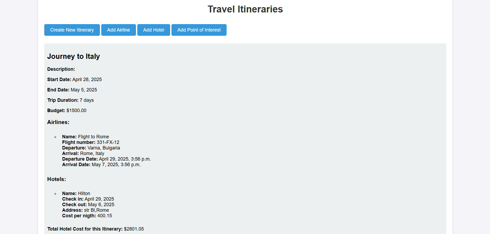
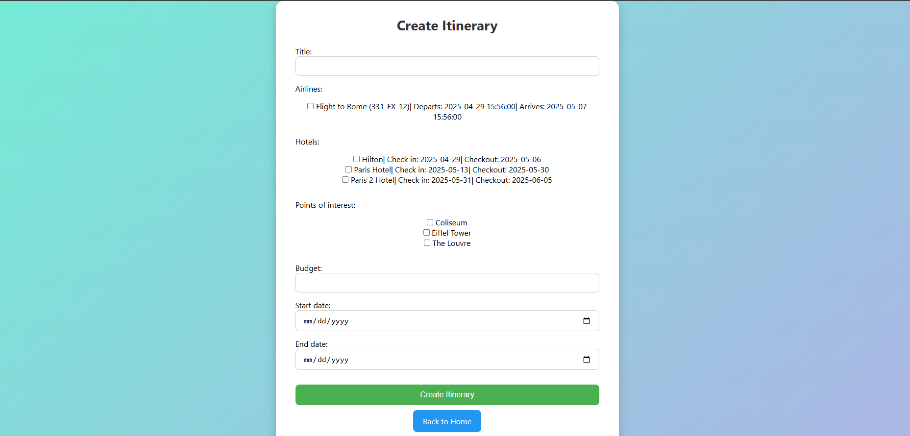
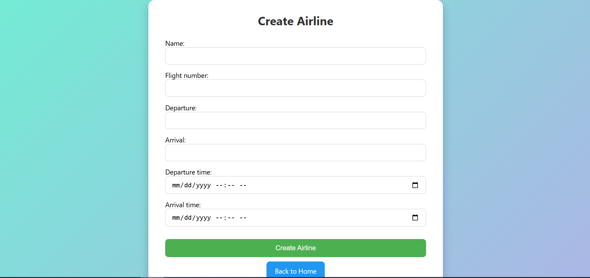

# Travel planner

## System Description – Travel Itinerary Planner

The Travel Itinerary Planner is a web-based system developed to help users organize their travel plans by allowing them to create detailed travel itineraries. Each itinerary includes key components such as airline bookings, hotel reservations, and points of interest at the destination.

The core functionality of the system revolves around data entry (Create), where users can add the following:

Itineraries: Each includes a title, description, start and end dates, and a budget.

Airlines: Users can add flight details such as airline name, flight number, departure/arrival times and locations.

Hotels: Users can register hotels with check-in/check-out dates, cost per night.

Points of Interest: Places worth visiting during the trip can be added with location and description.

Each of these entities is associated with a particular itinerary to give a complete view of a travel plan.

Limited CRUD Implementation
Although CRUD (Create, Read, Update, Delete) operations are fundamental to most applications, this system currently supports only the "Create" and "Read" functionality:

Create: Fully implemented for itineraries, airlines, hotels, and points of interest via dedicated forms.

Update, and Delete: These operations are not implemented in this version. Users can view the data they've entered on the homepage, but they cannot yet modify or remove it.

This setup serves as a foundation for future development to implement full CRUD capabilities.

## How to run the code
go to 18_final_project_4/travel_planner and run (before that make sure you have installed all the requirements in requirements.txt):
Then run the server:
```text
    python manage.py runserver
```

## Database structure - not the best implementation (but it works as some might say)

The database is designed using a star schema approach, where the central table is the Itinerary, and related entities such as Airline, Hotel, and Point of Interest are connected through many-to-many relationships. While this structure offers flexibility, it introduces redundancy—particularly for entities like flights and hotels, which typically have fixed date ranges and are often tied to a specific itinerary.

In practice, a flight or hotel booking is generally unique to a particular trip due to its specific check-in/check-out or departure/arrival dates. Therefore, the current many-to-many relationships may not be necessary and can lead to data duplication.

To enhance data normalization and efficiency, the design could be improved by introducing dedicated detail tables (e.g., HotelBookingDetails, FlightBookingDetails). This would separate reusable static data (e.g., hotel name, address, contact info) from trip-specific data (e.g., check-in date, cost per night), allowing:

A single instance of a hotel or airline to exist in the database.

Trip-specific details to be stored in a related table.

The possibility to link a single hotel or airline to multiple itineraries without redundancy.

This revised structure would maintain relational integrity while improving scalability and reducing data duplication. 

And to state the obvious, for maximum simplicity a foreign key relationship could be used, but I as as a developer I aim for scalability and flexibility, although I am fully awere now this is surely not be best approach.

## Main menu

Here you can see the main menu of the application, where you can add itineraries, airlines, hotels and points of interest. Also you see all the details for a existing itinerary, airline, hotel and point of interest - as well as the caculated period of the trip and the total cost of the trip (only for the hotels, since there is no cost for the airlines in the database).




This is the interface for adding a new itinerary. You choose form existing airlines, hotels and points of interest.



This is the interface for adding a new airline (it is default from forms.py). The other interfaces are identical as only the fields are different.
